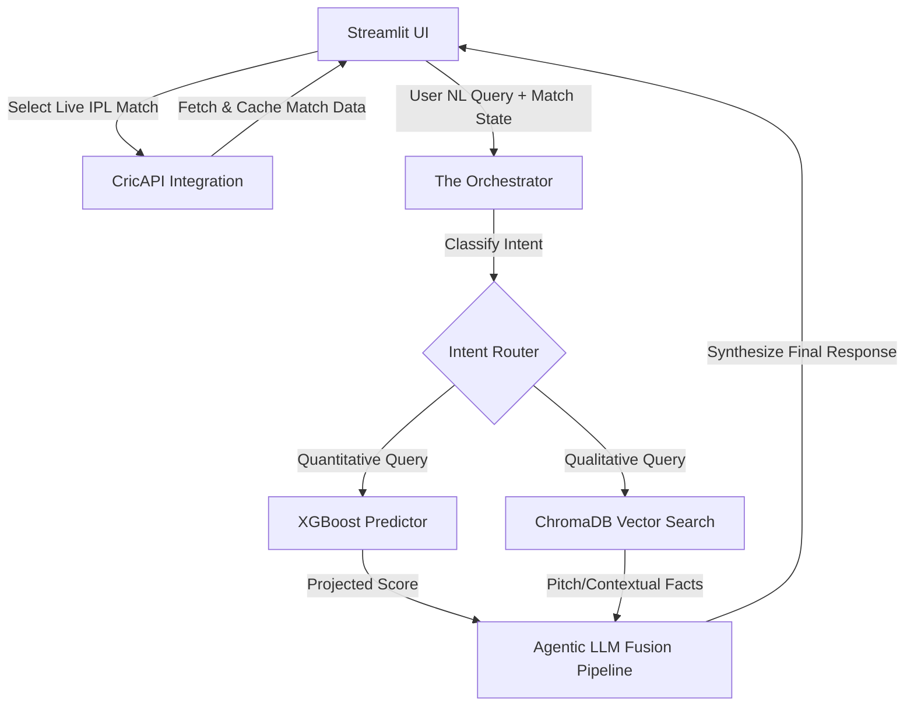

# 🏏 cricRAG Analytical Engine: Full-Stack AI & ML Pipeline


An enterprise-grade, dual-architecture AI system designed to forecast T20 cricket match outcomes and provide context-aware qualitative analysis via **Retrieval-Augmented Generation (RAG)**. cricRAG intelligently fuses a quantitative XGBoost machine learning model with a qualitative LLM brain, automatically fetching live IPL match data to provide highly accurate, contextual match predictions.

The app integrates a fully automated **Streamlit** dashboard, a local **ChromaDB Vector Store** for historical facts and pitch reports, and a central **Orchestrator** that dynamically routes natural language queries between the math engine and the text engine.

---

## 🚀 Key Technical Highlights

### 1. The Math Brain (XGBoost Regressor)
*   **The Feature:** A Gradient Boosting machine trained on 18 years of historical ball-by-ball delivery data to calculate live momentum, spatial venue constraints, and strategic game phases.
*   **The Impact:** Achieved a hyper-optimized baseline Mean Absolute Error (MAE), reducing it from 15.19 down to **12.43 runs**. Programmatically sanitized the dataset to neutralize "Super Over" anomalies and resolved decades of spatial venue naming fractures.

### 2. Fully Automated Live API Integration & Guardrails
*   **The Problem:** Free-tier sports APIs (like CricAPI) have strict rate limits (e.g., 100 hits/day), making live polling highly susceptible to exhaustion.
*   **The Solution:** The engine is built on a "Cache & Force-Refresh" strategy (`@st.cache_data(ttl=300)`). It silently caches active IPL matches for 5 minutes, allowing up to 8 hours of continuous use without breaking the free-tier limits, while providing users a manual force-refresh button for critical match events. Furthermore, a strict popup modal ensures users read compliance disclaimers before usage.

### 3. The Text Brain (Qualitative RAG)
*   **The Feature:** Ingests raw, unstructured qualitative data (like `ipl_2026_facts.txt` and pitch reports), segments them via Recursive Splitters, and compiles mathematical matrices using Google Text Embeddings.
*   **The Impact:** Stores vectorized chunks in a persistent local **ChromaDB** index, allowing the agent to instantly retrieve real-world facts regarding pitch behavior, weather impact, or player injuries that pure numbers can't account for.

### 4. The Orchestrator (Semantic Intent Router)
*   **The Feature:** Acts as the Central Nervous System of the application. 
*   **The Impact:** It classifies natural language intent and dynamically routes traffic. If you ask *"Predict the final score"*, it hits the XGBoost model. If you ask *"What is the pitch report?"*, it queries the RAG vector space. If you ask both, it fuses them into a comprehensive analytical response.

---

## 🛠️ System Architecture



---

## 💻 Tech Stack

### **Backend & AI Engine**
*   **XGBoost & scikit-learn**: Core predictive modeling.
*   **LangChain**: Orchestrating agents, retrievers, and LLMs.
*   **ChromaDB**: Local vector store for qualitative context.
*   **Google Gemini APIs**: Powering both the text embeddings and the primary Generative AI responses.
*   **Groq**: Extremely fast inference engine serving as the fallback LLM.
*   **Pandas**: Heavy data sanitization and feature engineering.

### **Frontend & APIs**
*   **Streamlit (v1.35.0)**: Fully reactive web dashboard, session state management, and modal dialogs.
*   **Requests**: Live API polling from CricAPI.

---

## ⚙️ Configuration & Setup

### Prerequisites
*   Python 3.10+
*   An API key from **CricAPI** (Free tier)
*   An API key from **Google Studio (Gemini)**
*   An API key from **Groq** (Free tier)

### **Local Deployment**
```bash
# 1. Clone & Setup Environment
git clone https://github.com/yourusername/cricRAG-analytical-Engine.git
cd cricRAG-analytical-Engine

# 2. Create virtual environment
python -m venv venv
# On Windows:
venv\Scripts\activate
# On macOS/Linux:
# source venv/bin/activate

# 3. Install dependencies
pip install -r requirements.txt

# 4. Build the Vector Database (Initial Run Only)
python backend/build_vectordb.py

# 5. Run the Application
streamlit run app.py
# → App running at http://localhost:8501
```

---

## 🔑 Environment Variables

Create a `.env` file in the root directory and add your required keys:

| Variable | Required | Description |
|---|---|---|
| `CRIC_API_KEY` | ✅ | Free tier key at [cricapi.com](https://cricapi.com/) for live IPL polling |
| `GEMINI_API_KEY` | ✅ | Primary LLM & Embeddings key from [Google AI Studio](https://aistudio.google.com/) |
| `GROQ_API_KEY` | ❌ | Fallback LLM inference key |
